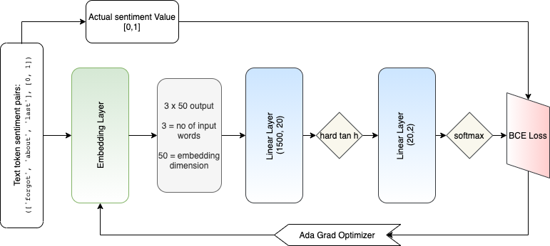

## SSWE : Sentiment Specific Word Embeddings
- This is an implementation of : https://aclanthology.org/P14-1146.pdf 

This paper gives us a way to learn task specific word embeddings by attaching an embedding layer at the start of the network and fitting model for predicting sentiment value. Architecture of SSWE is as follows:

### What I did?
I used custom embedding layer for a given vocabulary, and learned representations of words in 50 length vectors.
Model: I added 2 linear layers in front of Embedding layer as follows:

### Conclusion

This implementation tells us a way to generate task specific word embedding for any task. The generated embeddings should form clusters as words shares similar contextual properties. In the notebook we can see that model is conversing properly, however due to very less set of words, here we don't see much of clustering. I have also generated plots of embeddings by reducing their dimension via PCA / TSNE.

